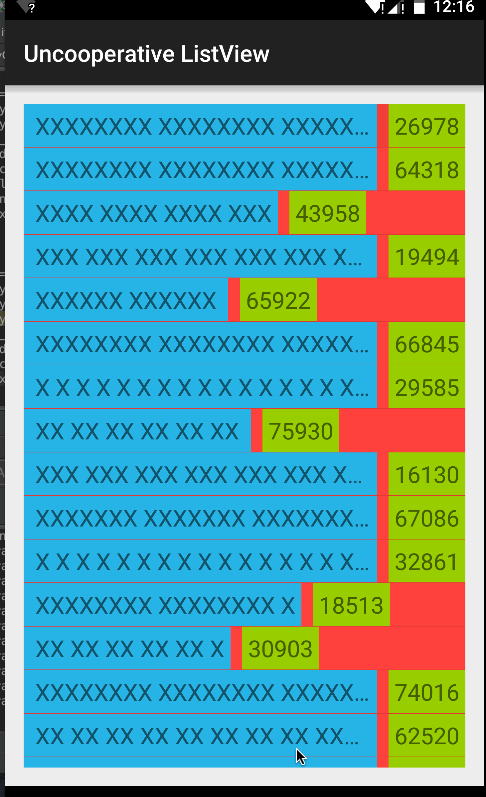

# Custom Layout

## Problem statement
Create a custom layout that addresses the following requirements:
* Horizontally positions two view elements, one on the right and another on the left.
* The view on the right takes priority when laying out elements horizontally.  I.e., the left hand view will receive any remaining space after the right hand view has been positioned.
* Needs to recognize all margin and padding layout parameters.

## Custom layout used to position an item in a ListView

